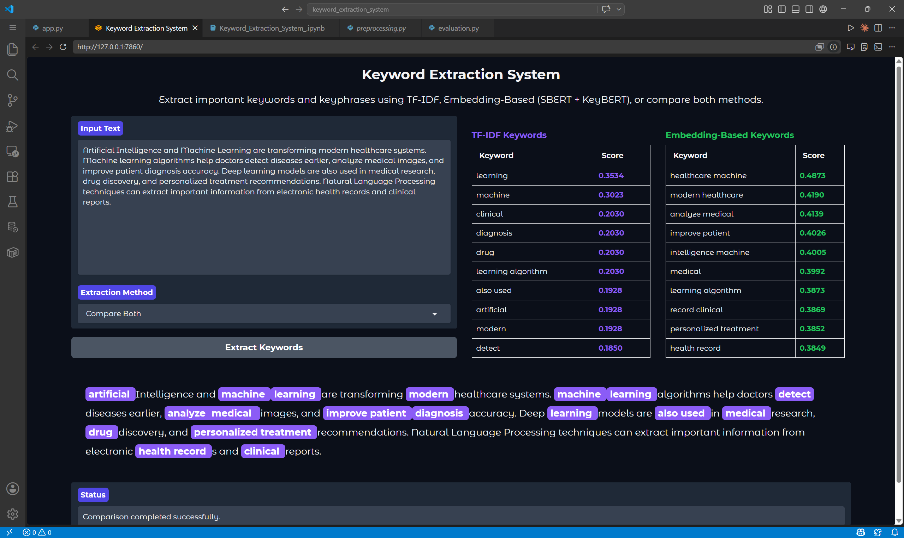

# Keyword Extraction System

A complete NLP-based Keyword Extraction System that identifies important keywords and keyphrases from textual data using both traditional and embedding-based approaches.

## GUI Preview



---

## Features

- TF-IDF Keyword Extraction
- Embedding-Based Keyword Extraction using Sentence-BERT + KeyBERT
- Side-by-side comparison between extraction methods
- Keyword highlighting inside text
- Interactive Gradio GUI
- Clean modular project structure
- Saved reusable NLP components using Joblib/Pickle
- No retraining required during GUI execution

---

## Technologies Used

- Python
- Scikit-learn
- NLTK
- Sentence-Transformers
- KeyBERT
- Gradio
- Joblib
- Pickle

---

## Project Structure

```text
KEYWORD_EXTRACTION_SYSTEM/
│
├── .venv/
├── data/
├── models/
│   ├── tfidf_vectorizer.pkl
│   ├── keybert_model.pkl
│   ├── stopwords.pkl
│   ├── lemmatizer.pkl
│   └── sbert_model_name.pkl
│
├── results/
├── src/
│   ├── __init__.py
│   ├── evaluation.py
│   ├── extraction.py
│   ├── features.py
│   └── preprocessing.py
│
├── app.py
├── Keyword_Extraction_System_.ipynb
├── requirements.txt
└── README.md
````

---

## Methods Implemented

### 1. TF-IDF (Baseline Method)

Uses Term Frequency–Inverse Document Frequency to identify important words based on statistical frequency within documents.

### 2. Embedding-Based Method

Uses:

* Sentence-BERT (SBERT)
* KeyBERT

to extract semantically meaningful keywords and keyphrases using transformer embeddings.

---

## GUI Features

The Gradio interface allows users to:

* Enter custom text
* Select extraction method
* Compare both methods
* View extracted keywords with scores
* Visualize highlighted keywords inside the text

---

## Installation

Clone the repository:

```bash
git clone <your-repository-link>
cd KEYWORD_EXTRACTION_SYSTEM
```

Install dependencies:

```bash
pip install -r requirements.txt
```

---

## Run the Application

Start the Gradio GUI:

```bash
python app.py
```

Then open:

```text
http://127.0.0.1:7860
```

in your browser.

---

## Example Test Scenario

### Input Text

```text
Artificial Intelligence and Machine Learning are transforming modern healthcare systems. Machine learning algorithms help doctors detect diseases earlier, analyze medical images, and improve patient diagnosis accuracy.
```

### Expected Output

* TF-IDF extracted keywords
* Embedding-based extracted keywords
* Highlighted keywords inside text
* Side-by-side comparison between methods

---

## Saved Components

The project saves reusable NLP components including:

* TF-IDF Vectorizer
* Sentence-BERT model reference
* KeyBERT model
* Stopwords
* Lemmatizer

This allows the GUI to load models directly without retraining.

---

## Future Improvements

* PDF/DOCX support
* Keyword download option
* Word cloud visualization
* HuggingFace Spaces deployment
* Docker containerization
* Streamlit version
* Multi-language support

---

## Author

Developed as an NLP project focused on practical keyword extraction, semantic analysis, and interactive AI deployment using modern NLP techniques.

```

